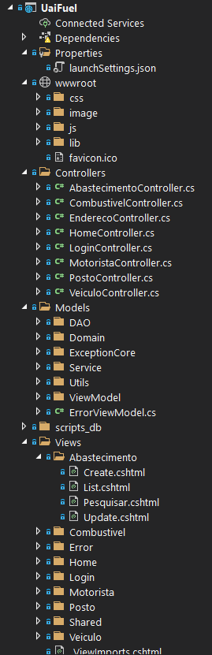
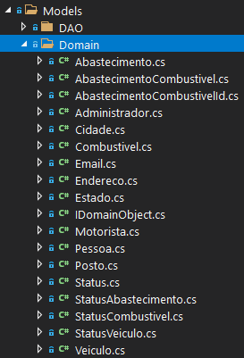

UaiFuel é um gerenciador de abastecimentos para postos de gasolina.

### Contexto

Projeto Inter.

- Eng. Soft 
- Sistemas de Informação
- Estr Dados
- Linguagem de Programação
- Comunicacao e Expressão

- Banco de Dados
- POO
- MetodoPesquisaCientíficaTecnológica

---

# Apresentação

---

# Arquitetura

O Microsoft Visual Studio tem um _template_ de projeto MVC (_Model-View-Controller_) para C# que utilizamos como base para o nosso projeto. 

## View
Os arquivos de estilização e javascript ficam na pasta `wwwroot`. Na pasta `Views` ficam os arquivos _Razor_ (cshtml) com seus _scriptlets_ de servidor embutido, usado pelo VB.NET para gerar as páginas html e fazer a interação com o usuário; basicamente teremos um arquivo cshtml para cada ação do controlador. 

## Controller
Na pasta `Controller` temos os controladores da aplicação, onde são definidas as ações (`ActionResult`) que consomem os serviços da camada `Model` e direcionam o fluxo da aplicação. 

<br>
_Figura: Estrutura do Projeto_

## Model

Esta é camada do MVC mais interessante e a que iremos aprofundar, porque representa o negócio e é a camada responsável pelo acesso e manipulação dos dados. A camada `Model` está subdivida em vários `namespaces` ou pastas para agrupar funcionalidades em comum. 

<br>
_Figura: namespace Domain_

### Domain

Neste _namespace_ ficam as classes dos objetos que representam as entidades do domínio, a versão orientada a objetos das entidades do modelo relacional do banco de dados. A sua maioria são POCO, _Plain Old Class Object_, o mesmo conceito que POJO (_Plain Old Java Object_), porém a Microsoft teve por política limpar qualquer vestígio Java e cunhou um nome mais neutro. A diferença entre POCO e DTO (_Data Transfer Object_) é que DTO só tem estado, enquanto POCO tem estado e comportamento.

As classes que não são POCO são a interface `IDomainObject` usada para tipagem genérica no namespace DAO e os _singletons_ criados para os status: `Status`, `StatusVeiculo`, `StatusCombustivel` e `StatusAbastecimento`. Na  CLR (_Common Language Runtime_) do .NET _enumerations_ são apenas constantes nomeadas, cujo tipo subjacente deve ser inteiro. Optamos por criar ___instâncias de tipo___ nomeadas, assim podemos criar _enums_ mais complexos, com vários tipos associados e ainda com comportamento. Nossa classe _enum_ foi feita com o padrão de projeto _Singleton_ - selamos a classe para impedir que seja estendida (_sealed_) por mecanismo de herança e fizemos o construtor privado para que ninguém, além da própria classe, possa instanciar objetos. 

A classe possui duas propriedades públicas de instância, `Codigo` e `Descricao`, mas apenas com acesso para leitura (`get`), o que impede eventual corrupção do seu valor. As instâncias nomeadas são atributos de classe (_static_) e são guardadas em uma lista _static_. Essa lista pode ser usada para carregar uma caixa de seleção suspensa(_ComboBox_), por exemplo. Podemos acessar os singletons diretamente pelo nome da classes (´StatusVeiculo.GARAGEM´, ´StatusVeiculo.MANUTENCAO´), ou pedindo ao singleton para buscar na lista, fornecendo o código ao método `StatusVeiculo.getInstance(codigo)`.

```c#
namespace UaiFuel.Models.Domain
{
    /** 
     * Singleton Pattern 
     */
   sealed public class StatusVeiculo
    {
        public int Codigo { get; }
        public string Descricao { get; }
        
        static public IList<StatusVeiculo> lista = new List<StatusVeiculo>();

        static public StatusVeiculo ATIVO       = new StatusVeiculo(1, "Ativo");
        static public StatusVeiculo MANUTENCAO  = new StatusVeiculo(2, "Em Manutenção");
        static public StatusVeiculo GARAGEM     = new StatusVeiculo(3, "Garagem");
        static public StatusVeiculo VENDIDO     = new StatusVeiculo(4, "Vendido");

        private StatusVeiculo(int codigo, string descricao)
        {
            Codigo = codigo;
            Descricao = descricao;
            lista.Add(this);
        }

        static public StatusVeiculo getInstance(int codigo)
        {
            foreach (StatusVeiculo s in lista)
            {
                if (s.Codigo == codigo)
                {
                    return s;
                }
            }
            return null;
        }

        public override string ToString()
        {
            return $"{Codigo} - {Descricao}";
        }
    }    
```
_Listagem 1: Singleton StatusVeiculo_

Um dos requisitos do projeto Interdisciplinar era ter ao menos um relacionamento N - N. Nós atendemos a exigência fazendo no mesmo abastecimento ter mais de um combustível: álcool e aditivo, diesel S10 e arla. A relação entre as entidades `Abastecimento` e `Combustivel` possui os campos `Valor` e `Litros` e fora mapeada para classe `AbastecimentoCombustivel`. 

A chave primária `pk` é uma chave composta e está modelada em `AbastecimentoCombustivelId`. Buscamos seguir no rigor dos princípios norteadores da Programação Orientada a Objetos, não inserimos simplesmente os id's inteiros das entidades dentro da relação, algo como `AbastecimentoId` e `CombustivelId`. Encapsulamos em uma classe a parte, fizemos a `pk` ser um objeto e não dois inteiro primitivo.    


### DAO
 
Não usamos nenhum _framework_ de mapeamento objeto-relacional, tinhamos menos de 3 meses para codificar e não daria tempo de estudar os detalhes do framework, então usamos o padrão DAO - _Data Access Object_. Seguindo o padrão, criamos uma classe abstrata (`DAOConnection`) para fazer a conexão com o banco e a qual todos os DAO's que manipulam os objetos de domínio devem estender. 

Os objetos DAO tem a responsabilidade de acessar e manipular os objetos de domínio. O acrônimo CRUD (`Create`, `Read`, `Update` , `Delete`) enumera as ações essencias que deve executar sobre os dados das entidades persistidas no banco de dados: criar, ler e listar, atualizar e apagar. Apesar de vermos alguns projetos com regras de negócio espalhadas em parte na camada _Service_ e parte na camada DAO, dentro do que estudamos nós entendemos como sendo um erro. A programação orientada a objetos orienta o isolamento de responsabilidade, e a camada DAO não deve ter nenhuma regra de negócio, ela é responsável exclusivamente por fazer a comunicação entre o banco de dados e a aplicação. Qualquer exceção lançada na execução dos métodos do DAO não devem ser tratadas por ele, quem deve ter a sapiência de avaliar a gravidade da _exception_ e dar o devido tratamento é a camada de serviço.  

O que queremos chamar a atenção do leitor é na interface `IDAO`. Esta interface faz uso de `Generics` para fazer acoplamento forte na tipagem entre o DAO e o objeto de domínio que manipula.

```C#
namespace UaiFuel.Models.DAO
{
    public interface IDAO<T> where T : IDomainObject, new()
    {
        public T Create(T domainObject);

        public void Update(T domainObject);

        public void Delete(T domainObject);

        public IList<T> Read();

        public T Read(object pk);
    }
}
```
_Listagem 2: Interface IDAO com tipos genéricos_

No namespace `Domain` criamos a interface `IDomainObject` para fazer a marcação de tipo.

```C#
namespace UaiFuel.Models.Domain
{
    public interface IDomainObject
    {
    }
}
```
_Listagem 3: Interface de marcação de tipo IDomainObject_

E fizemos todos os objetos de domínio serem subtipos de `IDomainObject`.

```C#
public class Veiculo : IDomainObject
public class Combustivel : IDomainObject...
public class Abastecimento : IDomainObject...
...
```
_Listagem 4: Todos os objetos de domínio são do tipo comum IDomainObject_

C# não permite herança multipla, então fizemos as classes concretas do DAO estender a classe abstrata `DAOConnection` e implementar a interface `IDAO`.

```C#
class VeiculoDAO : DAOConnection, IDAO<Veiculo>...
class CombustivelDAO : DAOConnection, IDAO<Combustivel>
class AbastecimentoDAO : DAOConnection, IDAO<Abastecimento>
...
```
_Listagem 5: Objetos DAO devem implementar os métodos CRUD da interface IDAO_

Revendo a listagem 2, podemos entender agora a importância do uso do _Generics_. O DAO deve ter um acoplamento forte com o tipo de objeto de domínio que ele manipula. Isso impede o `VeiculoDAO` de manipular qualquer outro objeto que não seja `Veiculo`.


### Service

A camada de serviço é a interface entre `Model` e `Controller`. O controlador recebe as requisições do usuário e se comunica com o modelo através dos serviços oferecidos na subcamada _service_. Service detém a semântica da aplicação, todas as regras ou lógica de negócio estão nesta camada. A camada _service_ sabe avaliar o nível de gravidade de uma exceção lançada, seja uma execeção do banco ou da aplicação, se é grave ou apenas uma advertência - criamos a classe `AlertType` para esta finalidade. Nós criamos algumas classes `Exceptions` para auxiliar na identificação e posterior tratamento, como `UniquePlacaException` que cuida da duplicação de placas de veículos. A camada Service é provedora de serviços ao controlador e é cliente da camada DAO.


### ViewModel

Os objetos do ViewModel são DTO's usados pelo controlador para carregar as informações necessárias a renderização das _views_ (páginas). São objetos de transferência de dados entre a camada Model e a View. Estes objetos estão muito condicionados às demandas das páginas html, por vezes podem ter dados parciais de mais de um objeto de domínio. 

Seus nomes costumam ser a combinação da página da _view_ do objeto de domínio com a ação (`Action`) do controlador sobre o objeto de domínio: `MotoristaViewModel`, `CreateMotoristaViewModel`, `UpdateMotoristaViewModel`.   

`PesquisaAbastecimentoViewModel` é um bom exemplo de DTO híbrido; só tem estado (_properties_), sem comportamento (métodos). Na listagem podemos ver que esse ViewModel possui informações parciais de varios objetos de domínio misturadas, todos os campos necessários ao carregamento da página de pesquisa de abastecimento.

```C#
namespace UaiFuel.Models.ViewModel
{
    public class PesquisaAbastecimentoViewModel
    {
        public string CombustivelId { get; set; }
        public string NomeCombustivel { get; set; }
        public string VeiculoPlaca { get; set; }
        public string PostoId { get; set; }
        public string NomePosto { get; set; }
        public string MotoristaId { get; set; }
        public string NomeMotorista { get; set; }
        public DateTime DataInicial { get; set; }
        public DateTime DataFinal { get; set; }
        public string StrDataInicial { get; set; }
        public string StrDataFinal { get; set; }


        public string CodigoStatus { get; set; }
        public List<SelectListItem> Statuses { get; set; }
        public IList<Abastecimento> Abastecimentos { get; set; }
        public IList<PessoaViewModel> Postos { get; set; }
        public IList<PessoaViewModel> Motoritas { get; set; }
        public IList<Veiculo> Veiculos { get; set; }

        public bool RealizouPesquisa { get; set; }

        public PesquisaAbastecimentoViewModel()
        {
            RealizouPesquisa = false;

            Abastecimentos = new List<Abastecimento>();
            Postos = new List<PessoaViewModel>();
            Motoritas = new List<PessoaViewModel>();
            Veiculos = new List<Veiculo>();

            Statuses = new List<SelectListItem>();
            foreach (var status in StatusAbastecimento.lista)
            {
                Statuses.Add(
                    new SelectListItem
                    {
                        Value = status.Codigo.ToString(),
                        Text = status.Descricao
                    });
            }
        }
    }
}

```
_Listagem 6: PesquisaAbastecimentoViewModel: DTO para transferir os filtros e resultados da pesquisa_

As regras de negócio da visualização devem ficar no `Controller`, logo, é o controlador que verifica e preenche os modelView's. A camada de serviço do Model cuida apenas das regras dos objetos de domínio da aplicação. O controlador usa a camada Service para carregar modelView's, ou traduzir apropriadamente um modelView de uma requisição do usuário em uma chamada de serviço da camada Model. 


eder

